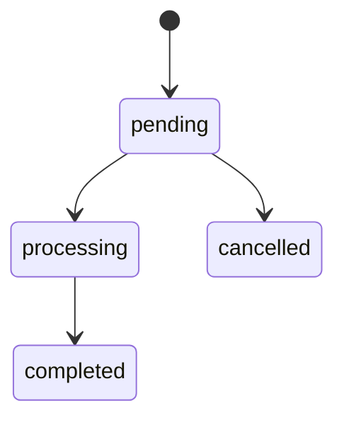

# Application Rules Generation — Master Prompt

> Purpose: Instruct an AI agent to analyze an existing application and produce a complete, well-structured `rules/` documentation system.  
> Context: A set of `.md` files inside a `rules/` directory that serve as a persistent knowledge base for all future AI agents working on this project.
> Version: 1.0.0

---

## How to use this document

Copy this file into the root of any project and run the following prompt with your AI agent:

```
Analyze the entire codebase before writing a single file.
```

---

## Phase 0 — Analysis (do this before creating any files)

Before writing anything, the agent **must** perform a full codebase analysis:

1. Read and understand the directory structure
2. Identify the framework, language versions, and key dependencies from `composer.json` / `package.json` / `pyproject.toml` (whichever applies)
3. Read all migration files to understand the full database schema
4. Read all model files to understand relationships, scopes, casts, and business rules embedded in models
5. Read all service, action, and use-case classes to extract business logic
6. Read all route files to map the full API / web surface
7. Read all policy and gate definitions to understand authorization rules
8. Read all job, event, listener, and notification classes to map async flows
9. Read existing tests (if any) to understand intended behaviour
10. Read the `.env.example` to understand the configuration surface

**Do not create any files until the full analysis in Phase 0 is complete.**

---

## Phase 1 — Create the `rules/` directory structure

After analysis, create the following directory and file structure exactly:

### 1. Core principle

* Structure first. Content second.
* Always create all required directories and files
* Do not skip files even if content is missing
* Mark files _Not applicable — ..._ when a domain or concept does not exist
* Ensure every file has a clear, deterministic location

### 2. Mandatory directory structure

The rules/ directory must include:

```
rules/
├─ README.md
├─ _meta/
│  └─ how-to-write-rules.md
├─ database/
│  └─ schema.md
├─ domain/
│  └─ {domain-name}.md
├─ api/
│  └─ endpoints.md
├─ process/
│  ├─ architecture-design.md
│  ├─ observability.md
│  ├─ ai-workflow.md
│  ├─ ci-cd.md
│  ├─ security.md
│  └─ testing-strategy.md
```

**Rules:**
* Include all directories and files listed above
* Create placeholders for non-existent domains or processes
* Avoid leaving gaps in the hierarchy
* Follow exact naming conventions (lowercase, hyphenated)

### 3. Forbidden behaviors
* ❌ Skipping files because content is not ready
* ❌ Randomly renaming files or directories
* ❌ Mixing unrelated domains in one file
* ❌ Omitting _meta/ guidelines
* ❌ Inconsistent file hierarchy between projects

### 4. Definition of done
* The rules/ directory is complete when:
* All directories exist
* All files exist (real or placeholder)
* Naming conventions respected
* Placeholders marked _Not applicable when needed
* _meta/how-to-write-rules.md included and consistent
* New domains documented in separate files

### Checklist
- [ ] All directories created
- [ ] All files created (or placeholders)
- [ ] Naming conventions followed
- [ ] _Not applicable marked where needed
- [ ] _meta/how-to-write-rules.md present
- [ ] Directory ready for content population

---

## Phase 2 — File specifications

Below are the exact requirements for every file the agent must produce.

---

### rules/README.md — Master index (AI entry point)

# Rules Directory — Master Orchestrator

> **Purpose:** Serve as the single entry point for AI agents to understand all mandatory rules, dependencies, and execution order.  
> **Context:** Read this file first. Follow the steps exactly before touching any code, schema, or documentation.  
> **Version:** 1.0

## 1. Core Principle

Before any task:

1. Understand the rules directory structure
2. Identify which files are relevant to your task
3. Follow rules strictly in order
4. Produce complete and auditable output

> The agent **must never skip reading any required file**. All domain, process, and meta rules are part of the source of truth.

## 2. Directory Overview

```
rules/
├─ README.md                        ← You are here
├─ _meta/
│  └─ how-to-write-rules.md         ← File structure and writing standards
├─ database/
│  └─ schema.md                     ← Database schema documentation rules
├─ domain/
│  └─ {domain-name}.md              ← Business domain rules (one per domain)
├─ api/
│  └─ endpoints.md                  ← API contract rules
├─ process/
│  ├─ architecture-design.md        ← Design before implementation
│  ├─ observability.md              ← Logging, metrics, monitoring
│  ├─ ai-workflow.md                ← AI agent lifecycle rules
│  ├─ ci-cd.md                      ← CI/CD and pipeline rules
│  ├─ security.md                   ← Security and safe coding rules
│  └─ testing-strategy.md           ← Test strategy and coverage rules
```

## 3. Reading & Execution Order

When performing a task, the AI agent **must follow this sequence**:

| # | File | Purpose |
|---|------|---------|
| 1 | `_meta/how-to-write-rules.md` | Understand formatting, structure, and standards for all rules files |
| 2 | `process/architecture-design.md` | Perform pre-implementation design. Document diagrams, affected layers, boundaries |
| 3 | `process/ai-workflow.md` | Review lifecycle rules: understand, design, implement, verify, document |
| 4 | `database/schema.md` | Read database schema before touching migrations, tables, or relations |
| 5 | `domain/{domain-name}.md` | Read all relevant domains to understand business rules, state machines, invariants |
| 6 | `api/endpoints.md` | Understand API contracts. Do not implement endpoints not defined in Swagger |
| 7 | `process/observability.md` | Ensure logs, metrics, health checks, and request tracing will be included |
| 8 | `process/ci-cd.md` | Validate pipeline rules. Ensure automated testing and deployment constraints |
| 9 | `process/security.md` | Read security rules before modifying auth, input handling, or secrets |
| 10 | `process/testing-strategy.md` | Ensure tests will cover all changes and critical paths |

> 🔹 **Rule:** Never implement before design and lifecycle steps are confirmed.

## 4. Self-Verification

Before reporting task completion, the agent **must check**:

- [ ] All relevant rules files read and applied
- [ ] Design artifacts exist if required
- [ ] Database, domain, API changes validated against rules
- [ ] Logging, metrics, and observability confirmed
- [ ] CI/CD compliance verified
- [ ] Security rules enforced
- [ ] Tests created or updated as mandated
- [ ] No forbidden behaviors introduced
- [ ] Documentation updated in `rules/` as needed

## 5. Reporting / Task Output

At the end of a task, the AI agent **must produce a structured report**:

1. **Files affected** — List all files touched
2. **Rules read** — Confirm each relevant rules file was read
3. **Design artifacts** — Include diagrams, impact analysis, or placeholders
4. **Verification checks** — List all checklist items passed
5. **Deviations** — Document any items skipped or marked `_Not applicable_`
6. **Summary** — State task completion, blockers, and next steps

**Example:**

```json
{
  "task": "Add new Order workflow",
  "files_affected": ["services/OrderService.ts", "domain/order.md"],
  "rules_read": [
    "process/architecture-design.md",
    "domain/order.md",
    "api/endpoints.md"
  ],
  "design_artifacts": ["component-diagram.png", "ERD-update.md"],
  "verification_checks": [
    "✅ Design approved",
    "✅ Tests created",
    "✅ CI/CD passed"
  ],
  "deviations": ["None"],
  "summary": "Task complete and ready for merge"
}
```

## 6. Best Practices

- Always create placeholders for non-existent domains or files
- Never assume defaults — follow explicit rules
- Stop immediately if a required rules file is missing
- Maintain consistency with existing code and rules
- Incremental and verifiable steps are mandatory

## Agent Entry Point Summary

| Step | Action |
|------|--------|
| 1️⃣ | Read this `README.md` first |
| 2️⃣ | Follow the reading & execution order strictly |
| 3️⃣ | Apply rules and document all steps |
| 4️⃣ | Verify using checklist in [Section 4](#4-self-verification) |
| 5️⃣ | Produce structured task report as in [Section 5](#5-reporting--task-output) |

---

### rules/_meta/how-to-write-rules.md — Rules for Writing Rules

```Markdown
> Purpose: This file defines the standard every rules file in this project must meet. It is self-referential — it must itself comply with the rules it defines.
> Context: Read this file before creating or updating any rules in the `rules/` directory.
> Version: 1.0
```

#### 1. Purpose
* Explain why this documentation system exists
* Describe what problem it solves
* Ensure consistency across all rules files
* Make onboarding for AI agents and developers deterministic

#### 2. Mandatory structure of every rules file

Every .md file in rules/ must contain:

1. A # Title matching the file’s subject
2. A > Context: blockquote explaining when an AI agent should read this file
3. Numbered sections with clear, imperative headings
4. At least one ✅ Correct and one ❌ Incorrect example per major rule
5. A ## Checklist section at the end

#### 3. Writing style rules

Language:
* Write all the rules in English
* Write in short, imperative sentences: "Use X", "Never do Y", "Always Z"
* Avoid vague qualifiers: "try to", "consider", "might want to" — state rules definitively
* Use second person: "the agent must", "you must"

Code example formatting:

```php
// ✅ Correct
public function findById(int $id): ?User
{
    return $this->users->find($id);
}

// ❌ Incorrect — missing return type, untyped parameter
public function findById($id)
{
    return $this->users->find($id);
}
```

Decomposition rules:

* One rule per bullet point — never combine two rules in one sentence
* If a section grows beyond 10 bullets, split into subsections
* If a topic covers more than 3 distinct concerns, create a separate file

#### 4. Versioning and changelog rules

```Markdown
// ✅ Correct
> Version: 1.1
## Changelog
- BR-005 updated to include edge case validation
```

#### 5. Forbidden content

* ❌ Opinions without justification — every rule must have a reason
* ❌ Duplicate rules that already exist in another file — link instead
* ❌ Broken or hypothetical code examples
* ❌ Vague rules that cannot be verified (e.g., "write clean code")
* ❌ Rules that contradict another file without explicitly noting the override

#### 6. Checklist

- [ ] Title matches the file subject
- [ ] "> Context:" blockquote included
- [ ] Numbered sections present
- [ ] At least one ✅ Correct and one ❌ Incorrect example per major rule
- [ ] Examples are syntactically correct and runnable
- [ ] Decomposition rules followed
- [ ] Version included and maintained
- [ ] Forbidden content avoided

---

### rules/database/schema.md — Database Schema Rules

```Markdown
> Purpose: This file defines mandatory standards for documenting the database schema. It ensures that AI agents and developers fully understand data structure, relationships, and constraints before making changes.
> Context: Read this file before creating or modifying tables, columns, indexes, or migrations.
> Version: 1.0
```

#### 1. Core principle
The database is the source of truth.
* Every table must be documented
* Every column must be explained
* Every relationship must be explicit
* Hidden or implicit behavior is forbidden
* Schema changes without documentation are forbidden

#### 2. ERD rules (Mermaid diagram)

Every schema file must start with a Mermaid ER diagram.

**Requirements**
* Include all tables
* Include all primary keys
* Include all foreign keys
* Include relationship cardinality
* Keep names identical to real tables
* Diagram must be syntactically valid Mermaid

**Example**
```
erDiagram
    USERS {
        bigint id PK
        string name
        string email UK
        string password
        enum status
        timestamp email_verified_at
        timestamps
    }
    ORDERS {
        bigint id PK
        bigint user_id FK
        decimal total
        enum status
        timestamps
    }
    USERS ||--o{ ORDERS : "has many"
```

#### 3. Table documentation rules

Every table must have a dedicated section.

**Mandatory per table**
* Table name
* One-sentence purpose
* All columns
* All indexes
* All foreign keys

**Column rules**
Each column must include:
* name
* type
* nullable
* default
* description

**Template**

```
### `users`
Stores application users and authentication data.

| Column | Type | Nullable | Default | Description |
|---|---|---|---|---|
| `id` | `bigint` | No | auto | Primary key |
| `email` | `string` | No | — | Unique login identifier |
```

#### 4. Index rules

Indexes must be documented explicitly.

**Requirements**

* List every index
* Explain purpose of each index
* Explain query or access pattern it optimizes
* Avoid unexplained indexes

**Example**

```
**Indexes:**
- PRIMARY on `id`
- UNIQUE on `email` — prevents duplicates
- INDEX on `user_id` — used in all user-scoped queries
```

#### 5. Enum inventory rules
Every enum must be documented completely.

**Requirements**

* List every enum column
* List all possible values
* Explain meaning of each value
* Avoid undocumented magic strings

**Example**

```Markdown
**orders.status**
- pending — created but not paid
- paid — payment successful
- shipped — sent to customer
- cancelled — user or system cancelled
```

#### 6. Change management rules

Schema updates must follow strict process.

* Update ERD first
* Update table docs
* Update enums/indexes
* Then write migration
* Then write tests

Never merge migrations without documentation updates.

#### 7. Definition of done

A schema change is not complete until:

* ERD updated
* Table documented
* Columns documented
* Indexes documented
* Enums listed

Soft deletes justified

#### Forbidden behaviors
* ❌ Undocumented tables
* ❌ Missing column descriptions
* ❌ Raw SQL dumps instead of documentation
* ❌ Implicit relationships
* ❌ Magic enum values
* ❌ Schema changes without ERD updates

#### Checklist
- [ ] ERD diagram present
- [ ] Every table documented
- [ ] Every column documented
- [ ] Indexes explained
- [ ] Soft deletes justified
- [ ] Enums fully listed
- [ ] Docs updated before migration
- [ ] No forbidden behaviors

---

### rules/domain/{domain-name}.md — Domain Rules

```Markdown
> Purpose: This file defines mandatory documentation and behavior rules for a single business domain. It ensures that AI agents and developers understand business logic, invariants, and constraints before making changes.
> Context: Read this file before modifying anything related to {Domain}.
> Version: 1.0
```

#### 1. Core principle

Business logic must be explicit and centralized.

* Every rule must be documented
* Every invariant must be testable
* Every state change must be predictable
* Hidden business behavior is forbidden
* Code must never be the only source of truth

If a rule exists only in code, it is undocumented and unsafe.

#### 2. Domain overview rules

Each domain file must begin with a clear description.

**Requirements**
* 2–3 sentences describing responsibility
* Define domain boundaries
* Explain what this domain owns
* Explain what this domain does not own
* Avoid implementation details

**Template**
```
## What is this domain?

{Short description of responsibilities and boundaries}

## Key concepts

| Concept | Description |
|---|---|
| Order | A purchase request created by a user |
| Payment | Money transfer confirming an order |
```

#### 3. Business rules documentation

All business rules must be listed explicitly.

**Requirements**

* Number every rule (BR-001, BR-002, ...)
* Use declarative statements
* Describe behavior, not implementation
* Include enforcement location (file + method)
* Rules must be verifiable by tests

**Example**

```
## Business rules

**BR-001** — An order can only be cancelled if its status is `pending` or `processing`.  
_Enforced in:_ `app/Services/OrderService.ts @ cancel()`

**BR-002** — A user must verify their email before placing an order.  
_Enforced in:_ `middleware/ensureEmailVerified.ts`
```

#### 4. State machine rules (if applicable)

If the domain has a status or state field, transitions must be documented.

**Requirements**

* Use Mermaid state diagram
* Include all states
* Include all valid transitions
* Document forbidden transitions
* Document permission constraints
* Diagram must match real code

**Example**



#### 5. AI-specific rules

Because AI often spreads logic accidentally:
* Never invent undocumented business behavior
* Never duplicate rules in multiple places
* Always update this file when rules change
* Always add tests for every business rule
* Always check state machine consistency

#### 6. Definition of done

A domain change is not complete until:
* Domain overview updated
* Concepts documented
* Business rules listed or updated
* State machine updated (if applicable)
* Events documented
* Integrations documented
* Tests cover rules
* No hidden logic introduced

#### Forbidden behaviors
* ❌ Business rules only in code
* ❌ Unnumbered rules
* ❌ Implicit state transitions
* ❌ Direct DB mutations bypassing domain
* ❌ Undocumented events
* ❌ Hidden integrations
* ❌ Cross-domain coupling without documentation

#### Checklist
- [ ] Overview written
- [ ] Key concepts defined
- [ ] All business rules documented and numbered
- [ ] Enforcement locations listed
- [ ] State machine documented (if applicable)
- [ ] Events documented
- [ ] Integrations documented
- [ ] Tests cover rules
- [ ] No forbidden behaviors

---

### rules/api/endpoints.md — API Contract Rules (Single Swagger Source of Truth)

```markdown
> Context: Read this file before adding, modifying, or deleting any HTTP endpoint.
> Version: 3.0
```

#### 1. Core principle

The API is defined only by Swagger.

* Swagger is the contract
* Swagger is the documentation
* Swagger is the integration surface
* Swagger is the source of truth
* No parallel descriptions are allowed

If behavior exists in code but not in Swagger, it is a bug.

If Swagger exists but code differs, the implementation is a bug.

#### 2. Single file rule (mandatory)

The entire API must be described in one file.

**Requirements**
* Exactly one OpenAPI file for the whole project
* No per-endpoint files
* No Markdown endpoint descriptions
* No duplicated specs
* No alternative formats

**Location**

```
rules/api/openapi.yaml
```

```
✅ Correct
rules/api/openapi.yaml
```

```
❌ Incorrect
rules/api/endpoints/*.yaml
rules/api/endpoints.md
docs/api.md
swagger-per-route/
```

#### 3. Format rules (mandatory)

**Requirements**
* OpenAPI 3.x only
* YAML preferred
* Must be machine-readable
* Must be valid
* Must load in Swagger UI
* Must import into Postman
* Must support client generation

```
# ✅ Correct
openapi: 3.0.3
```

```
❌ Incorrect
Free-text Markdown
Hand-written tables
Partial specs
```

#### 4. Completeness rules (mandatory)

The specification must be exhaustive.

Every endpoint must include:
* summary
* description
* tags
* operationId
* security
* parameters (path/query/header/cookie)
* requestBody schema
* all response statuses
* response schemas
* examples
* error formats
* business rule references
* side effects
* rate limits (if applicable)

Nothing may be implicit.

#### 5. Path definition rules

Every route must be fully specified.

**Requirements**
* One operation per HTTP method
* All parameters typed
* Required flags set
* Descriptions provided
* Examples provided

```yaml
# ✅ Correct
paths:
  /users/{id}:
    get:
      summary: Get user by id
      description: Returns a single user resource
      operationId: getUserById
      tags: [Users]
```

```yaml
# ❌ Incorrect
paths:
  /users/{id}:
    get: {}
```

#### 6. Schema rules

All request and response bodies must use schemas.

**Requirements**
* Use components/schemas
* Reuse shared types
* No inline anonymous objects (unless trivial)
* Types must be explicit
* Required fields specified
* Enum values listed
* Examples provided

```yaml
# ✅ Correct
components:
  schemas:
    User:
      type: object
      required: [id, email]
      properties:
        id:
          type: integer
        email:
          type: string
```

```yaml
# ❌ Incorrect
schema:
  type: object
```

#### 7. Response rules

All possible responses must be documented.

**Requirements**

* Document every success status
* Document every error status
* Use consistent envelopes
* Provide example payloads
* Never expose internal data

```yaml
# ✅ Correct
responses:
  "200":
    description: Success
  "404":
    description: Not found
```

```yaml
# ❌ Incorrect
responses:
  "200": {}
```

#### 8. Business rule linkage

Business rules must be traceable.

Use vendor extensions:
```yaml
x-business-rules:
  - BR-001
  - BR-004
```
Do not duplicate logic in text.

#### 9. Side effects rules

All non-HTTP effects must be explicit.

Document using vendor extensions:
```yaml
x-side-effects:
  - dispatch UserRegistered
  - enqueue SendWelcomeEmail
  - call Stripe API
```
Hidden side effects are forbidden.

#### 10. Security rules
Security must be defined globally and per operation.

**Requirements**

* Define auth schemes in components/securitySchemes
* Specify security per route
* Never rely on implicit auth

```yaml
components:
  securitySchemes:
    bearerAuth:
      type: http
      scheme: bearer
```

#### 11. Validation rules (mandatory)
The file must always be valid.

**Requirements**
Before merging changes:

* Validate schema
* Lint spec
* Ensure Swagger UI loads
* Ensure Postman import works
* Ensure client generation succeeds

**Suggested tools**
* swagger-cli validate
* spectral lint
* openapi-generator

Broken specs are forbidden.

#### 12. Change workflow (mandatory)
Always follow this order:
* Update Swagger
* Validate spec
* Generate clients/types
* Implement code
* Write tests

Never implement first.

#### 13. AI-specific rules
Because AI generates endpoints:
* Never invent undocumented routes
* Never change behavior without updating Swagger
* Never guess schemas
* Always read Swagger first
* Treat Swagger as executable specification

#### 14. Definition of done

An API change is complete only if:

* openapi.yaml updated
* Spec valid
* New routes documented
* Schemas defined
* Examples provided
* Security defined
* Business rules linked
* Side effects listed
* Clients regenerate successfully
* Tests pass

#### Forbidden behaviors
* ❌ Markdown endpoint descriptions
* ❌ Per-endpoint files
* ❌ Missing schemas
* ❌ Missing examples
* ❌ Undocumented statuses
* ❌ Hidden side effects
* ❌ Code without spec
* ❌ Multiple Swagger files
* ❌ Divergence between code and spec

#### Checklist
- [ ] Single openapi.yaml exists
- [ ] All routes documented
- [ ] All params typed
- [ ] All schemas defined
- [ ] Examples present
- [ ] Security defined
- [ ] Business rules linked
- [ ] Side effects listed
- [ ] Spec validates
- [ ] Matches real behavior

---

### rules/process/architecture-design.md — Architecture & Design Before Implementation Rules

This file defines mandatory design steps that must occur before any code is written or modified.

It prevents accidental complexity, architectural drift, and large low-quality generations produced without planning.

Required sections:
```Markdown
# Architecture Design Rules
> Purpose: Ensure every change starts with explicit design. Force the agent to think structurally before generating code.
> Context: Read this file before implementing any feature, refactor, schema change, or new module.
> Version: 1.0
```

#### 1. Core principle

Design first. Code second.
* Never start with implementation
* Always define structure before details
* Always document boundaries
* Always minimize complexity

If design is missing → stop and design.

#### 2. Mandatory pre-implementation steps

Before writing any code, the agent must complete all steps below.

**Step 1 — Read context**
* Read rules/README.md
* Read architecture/overview.md
* Read relevant domain/*.md
* Read related source files
* Identify existing patterns to reuse

**Step 2 — Define the problem**
* State the goal in 1–3 sentences
* List non-goals explicitly
* Define success criteria
* Identify constraints (performance, security, compatibility)

**Step 3 — Propose a design**

Must include:
* Affected layers
* New/modified modules
* Public contracts
* Data model changes
* Risks and trade-offs

Do not write implementation yet.

**Step 4 — Validate the design**
* Check against architecture layer rules
* Check against existing conventions
* Check for duplication
* Check for simpler alternatives
* Prefer extending existing modules over creating new ones

Only after validation → implementation allowed.

#### 3. Required design artifacts

Depending on change type, create these artifacts.

**For new feature**
* Component diagram
* Data model updates
* API contract
* Test strategy

**For schema change**
* ERD update
* Migration plan
* Backward compatibility notes
* Rollback strategy

**For refactor**
* Before/after structure
* Risk assessment
* No behavior changes allowed unless specified

**For cross-cutting concerns**
* Explicit layer impact analysis

#### 4. Diagram requirements

All non-trivial changes must include diagrams using Mermaid.

Component example

```Mermaid
flowchart LR
    Controller --> Service
    Service --> Repository
    Repository --> Database
```

Sequence example

```Mermaid
sequenceDiagram
    Client->>API: POST /orders
    API->>Service: createOrder()
    Service->>DB: insert
    Service-->>Client: response
```

Diagrams must reflect real structure, not hypothetical designs.

#### 5. Layer boundary rules

All designs must respect layers defined in architecture/overview.md.

* Controllers handle transport only
* Services contain business logic
* Repositories handle persistence only
* Domain must not depend on frameworks
* Infrastructure must not leak into domain

```
// ✅ Correct — controller delegates
export async function create(req, res) {
  await orderService.create(req.body)
}
```

```
// ❌ Incorrect — business logic inside controller
export async function create(req, res) {
  if (req.body.total > 1000) applyDiscount()
}
```

#### 6. Complexity control rules

Prefer simplicity aggressively.

* Prefer modifying existing modules
* Avoid new abstractions without clear need
* Avoid premature generalization
* Avoid speculative flexibility
* Do not introduce patterns “just in case”

Rule of thumb:
* If a solution needs more than 3 new files, reconsider the design.

#### 7. AI generation limits

To reduce hallucination risk:

* Never generate an entire feature in one step
* Generate skeletons first
* Then implement one module at a time
* Review after each step
* Stop if output exceeds manageable size

Large monolithic generations are forbidden.

#### 8. Consistency rules

New code must look like existing code.

* Match naming style
* Match file structure
* Match dependency direction
* Match error handling style
* Match test patterns

Do not introduce a new architectural style mid-project.

```
// ✅ Correct — uses existing service pattern
class OrderService {}
```

```
// ❌ Incorrect — introduces random pattern
class OrderManagerFactoryBuilder {}
```

#### 9. Forbidden behaviors

* ❌ Coding before design
* ❌ Generating speculative architecture
* ❌ Introducing new frameworks without ADR
* ❌ Mixing layers
* ❌ Hidden schema changes
* ❌ Large “big bang” rewrites
* ❌ Copying patterns from unrelated projects

#### 10. Definition of ready

Implementation may start only if:
* Problem is defined
* Scope is bounded
* Design exists
* Diagrams created
* Impacted files listed
* Risks identified
* Rules checked

If any item is missing → design is incomplete.

#### Checklist

- [ ] Context files read
- [ ] Problem defined
- [ ] Design proposed
- [ ] Diagrams created
- [ ] Layers respected
- [ ] Complexity minimized
- [ ] No speculative abstractions
- [ ] Small incremental plan prepared

Documentation will be updated after implementation

---

### rules/process/observability.md — Observability, Logging, and Monitoring Rules

This file defines mandatory rules for logs, metrics, tracing, and runtime visibility.

It ensures that AI-generated and human-written code is debuggable, measurable, and operable in production.

Required sections:
```Markdown
# Observability Rules
> Purpose: Guarantee that every feature is observable in production. Prevent “black box” systems that cannot be debugged after deployment.
> Context: Read this file before implementing any endpoint, background job, integration, or infrastructure change.
> Version: 1.0
```

#### 1. Core principle

If you cannot observe it, you cannot operate it.

* Every flow must produce logs
* Every service must expose health signals
* Every critical action must be measurable
* Every failure must be traceable
* Silent failures are forbidden

#### 2. Structured logging rules

Logs must be structured and machine-readable.

**Mandatory rules**
* Use structured logs (JSON or key-value)
* Include timestamps automatically
* Include correlation/request ID
* Include severity level
* Include domain context (user_id, order_id, job_id, etc.)
* Never use free-form string logs only
* Never log sensitive data

```TypeScript
// ✅ Correct — structured log
logger.info("order_created", {
  orderId: order.id,
  userId: user.id,
  total: order.total
})
```

```TypeScript
// ❌ Incorrect — unstructured and useless
console.log("created order")
```

#### 3. Log level conventions

Use consistent severity levels.

**Levels:**
* debug - development diagnostics only
* info - business events (created, updated, started)
* warn - recoverable issues
* error - failures that affect functionality
* fatal - system cannot continue

**Rules:**
* Do not log everything as error
* Do not log business events as debug
* Production must not rely on debug logs

#### 4. Request tracing rules

All requests must be traceable end-to-end.

**Mandatory:**
* Generate request ID at entry point
* Propagate ID through services and jobs
* Include ID in every log line
* Pass ID to async jobs/events
* Include ID in error responses (non-sensitive)

```TypeScript
// ✅ Correct
req.context.requestId = uuid()
logger.info("processing_order", { requestId })
```

```TypeScript
// ❌ Incorrect — no traceability
logger.info("processing_order")
```

#### 5. Metrics rules

Every critical behavior must produce metrics.

**Must track:**

* request count
* error count
* latency
* job duration
* external API latency
* queue size
* DB query time (if supported)

**Rules:**

* Use counters for totals
* Use histograms for durations
* Avoid logging metrics as text
* Avoid ad-hoc metrics

```TypeScript
// ✅ Correct
metrics.counter("orders_created_total").inc()
metrics.histogram("order_processing_ms").observe(duration)
```

```TypeScript
// ❌ Incorrect
console.log("processing took 123ms")
```

#### 6. Health checks rules

Every service must expose health endpoints.

**Required endpoints:**
* /health/live — process is alive
* /health/ready — dependencies available
* /health/startup — startup completed (if applicable)

**Rules:**
* Must not perform heavy queries
* Must check critical dependencies only
* Must return simple status codes

```
// ✅ Correct
{ "status": "ok" }
```

```
// ❌ Incorrect
{ "status": "ok", "users": [...full dataset...] }
```

#### 7. Error tracking rules

All unexpected exceptions must be captured centrally.

**Mandatory**
* Capture unhandled exceptions
* Capture job failures
* Capture background worker crashes
* Include context metadata
* Deduplicate identical errors

Do not rely only on logs.

```TypeScript
// ✅ Correct
try {
  await service.process()
} catch (err) {
  logger.error("processing_failed", { err })
  throw err
}
```

```TypeScript
// ❌ Incorrect — silent failure
try {
    await service.process()
} catch (err) {}
```

#### 8. AI-specific observability rules

Because AI-generated code often lacks diagnostics:

* Always add logs for new flows
* Always add metrics for new endpoints
* Always instrument async jobs
* Never introduce silent catch blocks
* Never swallow exceptions

```TypeScript
// ✅ Correct
try {
  await service.process()
} catch (err) {
  logger.error("processing_failed", { err })
  throw err
}
```

```TypeScript
// ❌ Incorrect — silent failure
try {
  await service.process()
} catch (err) {}
```

#### 9. Sensitive data rules

Never expose private information in logs or metrics.

Forbidden:
* passwords
* tokens
* secrets
* full payload dumps
* personal data unless explicitly required

Mask sensitive fields when necessary.

#### 10. Definition of done for observability

A feature is not complete unless:

* Logs added for main flows
* Errors logged properly
* Metrics added
* Health checks unaffected
* Failures traceable by request ID

Observability is part of implementation, not an afterthought.

#### Forbidden behaviors

* ❌ Console-only logging
* ❌ Silent catch blocks
* ❌ Logging entire objects blindly
* ❌ Logging secrets
* ❌ No metrics for critical paths
* ❌ No health checks
* ❌ Relying on manual debugging only

#### Checklist
- [ ] Structured logs used
- [ ] Proper log levels applied
- [ ] Request IDs propagated
- [ ] Metrics added
- [ ] Health endpoints intact
- [ ] Errors tracked centrally
- [ ] No sensitive data logged
- [ ] No silent failures
- [ ] New flows observable in production

---

### rules/process/ai-workflow.md — AI-assisted development workflow rules

This file defines how an AI agent must work on this codebase, not what the system contains.
It standardizes behavior to ensure reproducibility, safety, and code quality.

Required sections:
```Markdown
# AI Workflow Rules
> Purpose: Explain that these rules constrain AI behaviour to prevent unsafe or low-quality changes and to make results deterministic across agents.
> Mandatory workflow (must be followed for every task): Document the exact step-by-step lifecycle an agent must execute before, during, and after any change.
> Context: Read this file before performing any modification, refactor, migration, or feature implementation.
> Version: 1.0
```

#### 1. Core principle

The agent must behave like a careful mid-level engineer, not an auto-generator.
* Always analyze before coding
* Always design before implementing
* Always test before finishing
* Never generate large changes blindly
* Never modify files you did not read


#### 2. Mandatory development lifecycle

Follow these steps strictly and in order.

**Step 1 — Understand**
* Read rules/README.md
* Read relevant domain files
* Read related code before proposing changes
* Identify existing patterns to follow

**Step 2 — Design**
* Propose architecture or schema changes first
* List impacted files
* Identify risks and edge cases
* Do not write code yet

**Step 3 — Implement**
* Make the smallest possible change
* Follow existing conventions exactly
* Reuse existing abstractions
* Avoid introducing new patterns unless required

**Step 4 — Verify**
* Run linters
* Run tests
* Add missing tests
* Validate types and contracts
* Check for security issues

**Step 5 — Document**
* Update relevant rules/*.md
* Update README if behaviour changed
* Update API docs if endpoints changed
* Update schema docs if DB changed

The task is not complete until documentation is updated.

#### 3. Scope control rules
* Only modify files directly related to the task
* Never refactor unrelated code opportunistically
* Never introduce “drive-by improvements”
* Large refactors must be separate tasks

```
// ✅ Correct — minimal targeted change
public function cancel(Order $order): void
{
    $order->update(['status' => 'cancelled']);
}
```

```
// ❌ Incorrect — mixes refactor with feature
public function cancel(Order $order)
{
    // rewrote repository, renamed services, changed architecture,
    // and also cancelled the order
}
```

#### 4. Generation size limits

* Prefer small iterations over big outputs
* Never generate more than one module at a time
* Never create more than 300–500 lines of new code without review
* Break large features into subtasks

Reason: large generations increase hallucination risk.

#### 5. Safety rules

* Never invent database columns that do not exist
* Never invent API fields not defined in schema
* Never guess business logic
* If unsure, ask or search the codebase
* Do not fabricate dependencies or packages

```
// ✅ Correct — uses existing field from schema
user.emailVerifiedAt

// ❌ Incorrect — hallucinated field
user.emailVerified   // does not exist
```

#### 6. Test-first expectations

* Add or update tests for every behaviour change
* Bug fixes must include regression tests
* New features must include happy path + edge cases
* Do not rely only on manual reasoning

#### 7. Documentation coupling rules

Every change must update rules.
Failure to update documentation means the task is incomplete.

#### 8. Forbidden behaviors

* ❌ Generating entire applications from scratch without notes
* ❌ Editing files without reading them first
* ❌ Ignoring existing conventions
* ❌ Silent schema changes
* ❌ Skipping tests
* ❌ Skipping documentation
* ❌ Making speculative optimizations

#### Checklist

- [ ] Relevant rules files read
- [ ] Existing code inspected
- [ ] Design proposed before implementation
- [ ] Minimal change applied
- [ ] Tests added or updated
- [ ] Linters pass
- [ ] Documentation updated
- [ ] No hallucinated fields or APIs introduced

---

### rules/process/ci-cd.md — CI/CD and Automated Workflow Rules

This file defines the rules an AI agent must follow to safely integrate, test, and deploy code in this project.

Required sections:
```Markdown
# CI/CD Rules
> Purpose: Ensure every change passes automated checks and deployments consistently. Guarantee that AI-generated code is validated and deployable before reaching production.
> Context: Read this file before touching any CI/CD pipeline, merge request, or deployment process.
> Version: 1.0
```

#### 1. Core principle

Every change must pass automated checks before merging or deploying.

* CI/CD is not optional
* No manual deployments without pipeline completion
* Broken pipelines must be fixed immediately
* Never disable checks to speed up delivery

#### 2. Pipeline stages

All commits must pass these stages in order:

2.1 Pre-commit / local checks
* Run linters
* Run type-checks
* Run unit tests
* Run static analysis
* Fail early if any error occurs

2.2 Continuous Integration (CI)
* Triggered on every push or pull request
* Must include:
    * Build verification
    * All automated tests (unit + integration)
    * Coverage report
    * Security scans (SAST)
* No merge without CI passing

2.3 Continuous Delivery / Deployment (CD)
* Deploy to staging environment automatically if CI passes
* Run smoke tests on staging
* Notify team/agent of success/failure
* Production deployment requires manual approval (unless fully automated safe mode is enabled)

#### 3. Rules for AI involvement
* AI must never merge directly into protected branches
* AI may propose pipeline updates only after analyzing current CI/CD configs
* AI must validate YAML/JSON configuration syntax before any commit
* AI-generated steps must adhere to existing tooling (GitHub Actions, Docker, etc.)
* AI must update rules/_meta/how-to-write-rules.md if any pipeline convention changes

#### 4. Forbidden actions
* ❌ Skipping tests or linters
* ❌ Writing deploy scripts that bypass approvals
* ❌ Changing secrets inline in code
* ❌ Hardcoding environment variables
* ❌ Ignoring failed jobs

#### 5. Examples

```yaml
# ✅ Correct — pipeline runs tests and deploys to staging
jobs:
  lint:
    runs-on: ubuntu-latest
    steps:
      - uses: actions/checkout@v3
      - run: npm install
      - run: npm run lint

  test:
    runs-on: ubuntu-latest
    steps:
      - uses: actions/checkout@v3
      - run: npm install
      - run: npm test

  deploy-staging:
    needs: test
    runs-on: ubuntu-latest
    steps:
      - run: ./deploy-staging.sh
```

```yaml
# ❌ Incorrect — deploy before tests
jobs:
  deploy:
    runs-on: ubuntu-latest
    steps:
      - run: ./deploy-production.sh
```

#### 6. Checklist before merging
- [ ] Linting passes
- [ ] All tests pass
- [ ] Coverage threshold met
- [ ] Security scans completed
- [ ] Staging deployment succeeded
- [ ] No speculative changes or secrets committed
- [ ] Rules documentation updated if pipeline changed

---

### rules/process/security.md — Security and Safety Rules

This file defines mandatory security practices for both AI agents and human contributors.
It exists to prevent vulnerabilities introduced by automated or assisted code generation.

Required sections:
```Markdown
# Security Rules
> Purpose: Ensure every change is secure by default. Prevent common classes of vulnerabilities frequently introduced by AI-generated code (injection, broken auth, leaked secrets, unsafe defaults).
> Context: Read this file before implementing any feature that touches authentication, input handling, database queries, external APIs, or configuration.
> Version: 1.0
```

#### 1. Core principle

Security is not optional or deferred.
* Always secure by default
* Always validate external input
* Always enforce authorization explicitly
* Never trust generated code blindly
* Never assume a route or service is internal-only

#### 2. Input validation rules

All external input is untrusted.

**Applies to:**
* HTTP requests
* CLI arguments
* queue payloads
* events
* third-party APIs
* files
* environment variables

**Mandatory rules**
* Validate all inputs at the boundary
* Reject unknown fields
* Use explicit schemas or DTOs
* Sanitize strings before storage
* Use typed objects instead of raw arrays
* Never pass request objects directly into domain logic

```
// ✅ Correct — validated DTO
const input = CreateUserSchema.parse(req.body)
userService.create(input)
```

```
// ❌ Incorrect — raw request passed directly
userService.create(req.body)
```

#### 3. Authentication rules

* Every protected route must require authentication
* Authentication must happen in middleware/guards only
* Never implement auth logic inside controllers or services
* Tokens must have expiration
* Sessions must be httpOnly + secure
* Never log tokens or passwords

#### 4. Authorization rules

Authentication ≠ authorization.

* Every sensitive action must check permissions
* Use policies/guards, not inline role checks
* Deny by default
* Avoid “admin bypass” logic
* Business rules must not rely on UI restrictions

```
// ✅ Correct — policy-based
orderPolicy.canCancel(user, order)
```

```
// ❌ Incorrect — hardcoded role
if (user.role === "admin") cancelOrder()
```

#### 5. Database safety rules

* Always use parameterized queries or ORM bindings
* Never concatenate SQL strings
* Never build dynamic SQL from raw input
* Use migrations only — no runtime schema changes
* Limit DB permissions per environment

```
-- ✅ Correct — parameterized
SELECT * FROM users WHERE email = ?
```

```
-- ❌ Incorrect — injection risk
SELECT * FROM users WHERE email = '${email}'
```

#### 6. Secrets management rules

* Secrets must only exist in environment variables or secret stores
* Never commit secrets to the repository
* Never hardcode API keys
* Never echo secrets in logs
* Never include secrets in tests or examples

```
// ✅ Correct
const key = process.env.STRIPE_API_KEY
```

```
// ❌ Incorrect
const key = "sk_live_123456"
```

#### 7. Dependency security rules

* Lock dependency versions
* Run dependency vulnerability scans in CI
* Remove unused packages
* Avoid abandoned libraries
* Prefer standard libraries when possible

Every PR must pass a dependency scan.

#### 8. AI-specific safety rules

* These rules exist specifically for AI agents.
* Never invent security mechanisms
* Never guess cryptography implementations
* Never design custom auth or crypto
* Use established libraries only
* Never fabricate fields like isAdmin or isSecure
* If unsure, stop and ask instead of guessing

Reason: hallucinated security logic is dangerous.

#### 9. Logging and data exposure rules

* Never log passwords
* Never log tokens
* Never log personal data unless required
* Mask sensitive fields
* Never return stack traces to clients
* Never expose internal IDs or debug info in API responses

```
// ✅ Correct
{ "error": "Unauthorized" }
```

```
// ❌ Incorrect
{ "error": "Unauthorized", "stack": ".../src/auth.ts:42", "token": "abc123" }
```

#### 10. Security checks required before merge

Every change must pass:
* Lint
* Tests
* Static analysis
* Dependency scan
* Security review of new endpoints
* Validation rules added for new inputs

If any step fails → do not merge.

#### Forbidden behaviors
* ❌ Disabling validation for convenience
* ❌ Skipping auth on “internal” routes
* ❌ Hardcoding credentials
* ❌ Writing custom crypto
* ❌ Trusting client-side validation only
* ❌ Catching and ignoring security errors silently
* ❌ Merging with known vulnerabilities

#### Checklist
- [ ] All inputs validated
- [ ] Auth required where needed
- [ ] Authorization enforced via policies
- [ ] No raw SQL concatenation
- [ ] No secrets in code
- [ ] Dependencies scanned
- [ ] Logs contain no sensitive data
- [ ] Tests cover security-critical paths
- [ ] No invented or speculative security logic

---

### rules/process/testing-strategy.md — Testing Strategy Rules

This file defines mandatory rules and processes for testing all changes in the project.
It ensures AI-generated or human-written code is reliable, maintainable, and fully covered.

Required sections:

```Markdown
# Testing Strategy Rules
> Purpose: Guarantee that every change is tested adequately before merging. Prevent regressions and silent failures in production.
> Context: Read this file before writing any code that affects behavior, APIs, database, or business logic.
> Version: 1.0
```

#### 1. Core principle

Test everything that can fail, and fail fast.

* Unit tests for individual components
* Integration tests for service interactions
* End-to-end tests for critical user flows
* Regression tests for previously fixed bugs
* Test-driven mindset: design tests before implementation

#### 2. Test hierarchy rules

Follow the test pyramid strictly:

2.1 Unit tests
* Cover single methods/functions
* Fast, deterministic, no external dependencies

2.2 Integration tests
* Cover interaction between services, database, and APIs
* Mock only external systems

2.3 End-to-end tests
* Cover full user workflows
* Use staging environment only
* Simulate realistic scenarios

#### 3. Test coverage rules

* Minimum 80% coverage per module
* Critical paths: 100%
* Always cover edge cases
* Cover error handling and validation
* Coverage measured automatically in CI
* Low coverage fails pipeline

#### 4. Test data rules

* Always use factories or fixtures
* Do not rely on existing production data
* Reset database between tests
* Avoid network calls in unit tests
* Seed realistic test data for integration and e2e tests
* Document seed data used

#### 5. Test naming rules

* Test names describe behavior, not implementation
* Use present tense, full sentences
* Include context and expected outcome
* Avoid cryptic abbreviations

```TypeScript
// ✅ Correct
test("user cannot place order without verified email", () => { ... })
```

```TypeScript
// ❌ Incorrect
test("test1", () => { ... })
```

#### 6. Forbidden test patterns
* ❌ Silent assertions (expect statements without checks)
* ❌ Tests that rely on timing (sleep, delays) unless unavoidable
* ❌ Hardcoded IDs or environment data
* ❌ Ignoring failed tests
* ❌ Skipping tests without documented reason
* ❌ Mocking critical logic excessively

#### 7. AI-specific test rules
AI-generated code must include:
* Unit tests for every new module
* Integration tests for every new service
* Edge case coverage for business rules
* Regression tests for any changed behavior
* Test scaffolding reviewed before implementation

#### 8. CI/CD integration rules

* All tests must run in CI
* Pull requests blocked if tests fail
* Coverage thresholds enforced automatically
* New tests must be included in coverage report

#### 9. Test-driven development rules
* Prefer TDD for new features
* Define test cases first
* Implementation only after tests exist
* Refactor safely under passing tests
* Document assumptions in tests

#### 10. Definition of done

A change is not complete until:

* Unit, integration, and e2e tests exist as required
* All tests pass locally and in CI
* Coverage thresholds met
* Edge cases tested
* No ignored or skipped tests
* Documentation updated if tests introduce new contracts

#### Checklist

- [ ] Unit tests created
- [ ] Integration tests created
- [ ] E2E tests created if required
- [ ] Critical paths covered 100%
- [ ] Edge cases tested
- [ ] Database fixtures/factories used
- [ ] Tests run in CI and passed
- [ ] Coverage thresholds met
- [ ] Test names descriptive and consistent
- [ ] No forbidden patterns used
- [ ] Documentation updated if necessary
